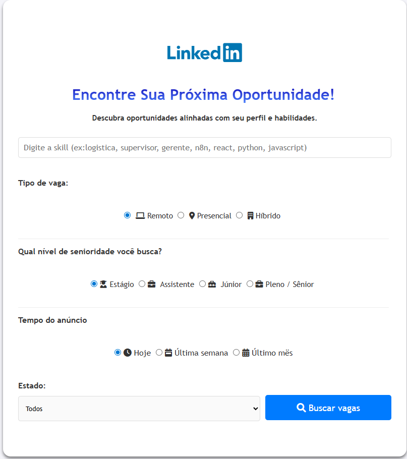

# DevVagas 💼🤖  

[](https://github.com/seu-usuario/devvagas/releases/tag/v1.0.0)  
[](https://github.com/seu-usuario/devvagas/actions)  
[](LICENSE)  

---

## 📸 Preview  

  

---

## 📌 Sobre  

**DevVagas** é uma automação inteligente para **buscar vagas de emprego no LinkedIn**.  

A proposta é simplificar a etapa de **pesquisa e organização de vagas**, economizando tempo e centralizando oportunidades relevantes em um fluxo automatizado.  

**Funcionalidades principais:**  
- 🔍 Busca automatizada de vagas no **LinkedIn**.  
- 📑 Organização de resultados em formato estruturado.  
- ⚡ Integração com **n8n** para automação dos fluxos.  
- 🧠 Uso de **IA** para filtrar, classificar e ranquear oportunidades.  
- 📊 Histórico centralizado para acompanhamento das candidaturas.  

---

## 🔧 Tecnologias  

  
  
  
  
  

---

## 🖼️ Fluxo Simplificado  

```mermaid
flowchart TD
    A[Busca no LinkedIn] --> B[n8n Workflow]
    B --> C[Processamento de Dados + IA]
    C --> D[Classificação de Vagas]
    D --> E[Organização e Histórico]